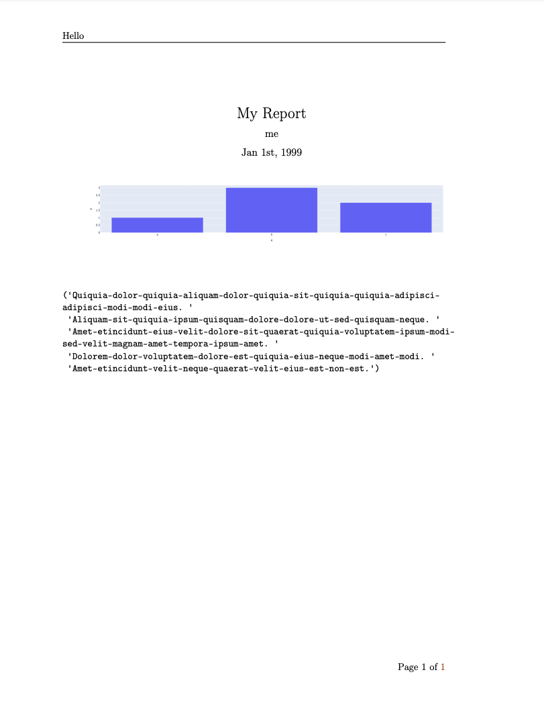

# jupyter-pdf-report
Tools to make a nice looking, no-code, report from Jupyter.

# HowTo
Add the following to the last cell in your Jupyter document.

```python
from jupyter_pdf_report.report import Report
Report().build_pdf({"title":"My Report",
                    "header":[["L", "Hello"]],
                    "footer":[["R", "Page \\thepage\ of \pageref{LastPage}"]],
                    "date":"Jan 1st, 1999",
                    "author":["me"]})
```


